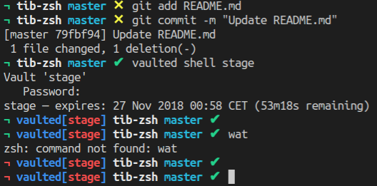

# tib-zsh
A theme for [oh-my-zsh](https://ohmyz.sh)

### Features
* Shows dirty/clean git state (i.e uncommitted changes) and current branch.
* Shows [vaulted](https://github.com/miquella/vaulted) active sessions.
* Shows `kubectl` config & active context.



### Install

```sh
git clone https://github.com/tiborv/tib-zsh.git \
    && cd tib-zsh \
    && cp tib.zsh-theme ~/.oh-my-zsh/custom/themes
```
or

```sh
curl https://raw.githubusercontent.com/tiborv/tib-zsh/master/tib.zsh-theme >\
~/.oh-my-zsh/custom/themes/tib.zsh-theme
```

Set theme in your `~/.zshrc`:
```sh
ZSH_THEME="tib"
```
Restart terminal

